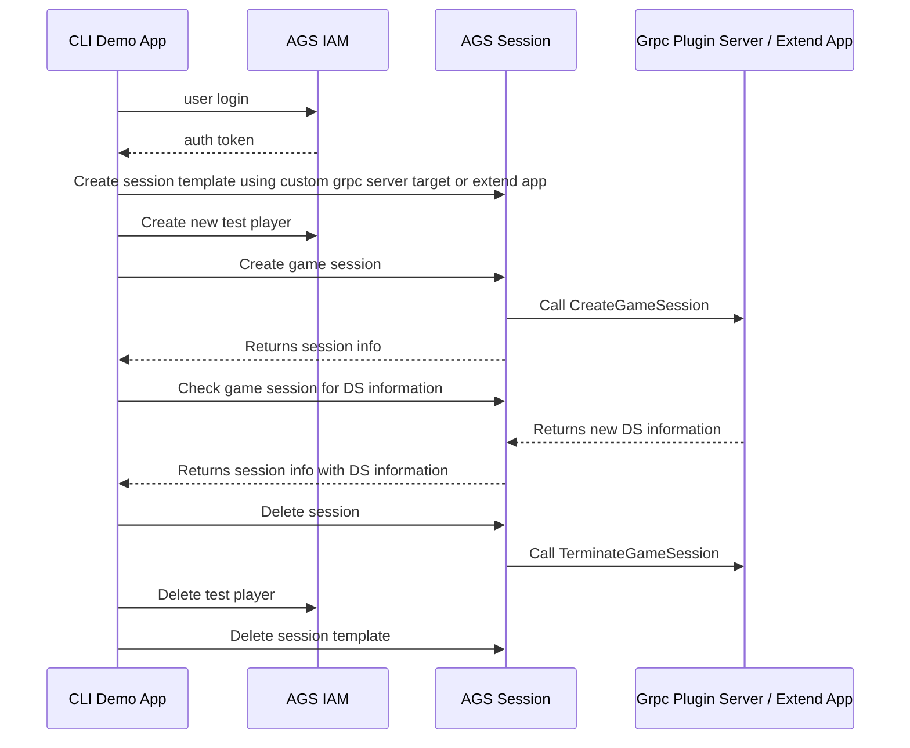

# Platform Service's Custom DSM Plugin gRPC Demo App

A CLI demo app to prepare required data and execute Custom DSM Plugin gRPC for AGS's Platform Service.
Following diagram will explain how this CLI demo app works.


## Prerequsites

* Java 11
* Gradle

## Build

To build this CLI demo app, execute the following command.

```bash
$ ./gradlew installDist
```
or
```bash
$ ./gradlew imageNative
```
to utilize GraalVm.

## Usage

### Setup

The following environment variables are used by this CLI demo app.
```
export AB_BASE_URL='https://test.accelbyte.io'
export AB_CLIENT_ID='xxxxxxxxxx'
export AB_CLIENT_SECRET='xxxxxxxxxx'

export AB_NAMESPACE='namespace'
export AB_USERNAME='USERNAME'
export AB_PASSWORD='PASSWORD'
```
If these variables aren't provided, you'll need to supply the required values via command line arguments.

Also, you will need `Custom Session DSM Plugin Plugin gRPC` server already deployed and accessible. If you want to use your local development environment, you can use tunneling service like `ngrok` to tunnel your grpc server port so it can be accessed by AGS.
> Current AGS deployment does not support mTLS and authorization for custom grpc plugin. Make sure you disable mTls and authorization in your deployed Grpc server.

### Executable
- Without GraalVm, the executable is:
```
app/target/install/app/bin/app
```
- Or, with GraalVm, the executable is:
```
app/target/graal/platformGrpcDemo
```

### Example
CLI demo app requires only the grpc server url as a parameter.

- Without any environment variables
```bash
$ ./app/target/install/app/bin/app -b='https://test.accelbyte.io' -c='CLIENT-ID-VALUE' -s='CLIENT-SECRET-VALUE' -n='NAMESPACE-VALUE' -u='<USERNAME>' -p='<PASSWORD>' -g='<GRPC_PLUGIN_SERVER_URL>'
```
- With basic environment variables setup
```bash
$ ./app/target/install/app/bin/app -u='<USERNAME>' -p='<PASSWORD>' -n='<NAMESPACE-VALUE>' -g='<GRPC_PLUGIN_SERVER_URL>'
```
- With all environment variables setup
```bash
$ ./app/target/install/app/bin/app -g='<GRPC_PLUGIN_SERVER_URL>'
```
- Use Extend App instead of grpc server url
```bash
$ ./app/target/install/app/bin/app -a='<EXTEND_APP_NAME>'
```

- Show usage help
```bash
 $ ./app/target/install/app/bin/app -h
```